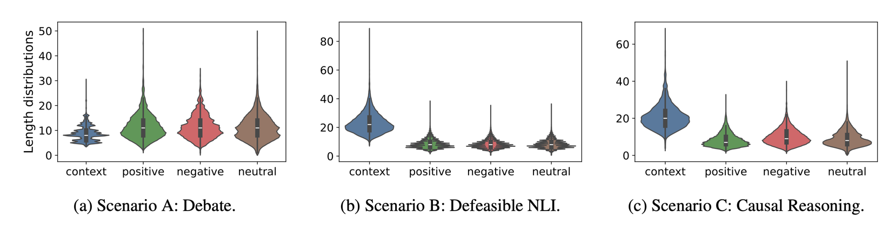

# Dichotomous Score
For the project of dichotomous score

## Environments

```bash
conda create -n dichotomy python=3.9
conda activate dichotomy
pip install -r requirements.txt
python -m spacy download en_core_web_sm
```


## 🗂️ Supportive Datasets (Quick Overview)

| Scenario | Train | Val | Test | Total | Avg len (ctx) | Avg len (pos/neg/neu) |
|----------|------:|----:|-----:|------:|--------------:|----------------------:|
| Debate               | 58 k | 21 k | 16 k | **95 k** | 8.8 | 11.6 / 11.5 / 11.2 |
| Defeasible NLI       | 8 k  | 8 k  | 424 k | **441 k** | 23.1 | 8.5 / 8.3 / 8.4 |
| Causal Reasoning     | 14 k | 18 k | 16 k | **48 k** | 21.0 | 8.4 / 10.1 / 9.1 |



**Figure 1.** Sentence-length distributions for contexts, positive, negative, and neutral arguments across datasets.


> **Why it matters**  
> *Balanced lengths & human-verified neutrals stop models from “cheating” on superficial cues and keep the focus on genuine oppositional content.*


# Opposite-Score
Efficient embeddings and scoring mechanism for detecting contrasting or opposite relationships in text, based on a given context.

[Opposite-Score](https://github.com/your-repo/opposite-score) is designed to generate embeddings and compute the **opposite-score**, which quantifies the degree of contrast or opposition between two textual outputs within the same context. This package is particularly useful in scenarios like debates, legal reasoning, and causal analysis where contrasting perspectives need to be evaluated based on shared input.

## Features
- **Opposite-Score Calculation**: Computes a numerical score representing how opposite two texts are, conditioned on a shared context.
- **Opposite-Aware Embeddings**: Generates embeddings optimized for contrasting textual relationships.
- **Easy to Use**: Only a few lines of code to get sentence/token-level embeddings and calculate opposite scores.
- **Automatic Model Download**: The first initialization automatically downloads and installs the pre-trained Opposite-Score model.

## Installation
Install Opposite-Score via pip:
```bash
pip install opposite-score==0.1.0
```


## Usage Examples

### For Opposite Scores of two sentence conditioned on the context.

```python

from oppositescore.model.dichotomye import DichotomyE

# Example inputs
context = ["A company launches a revolutionary product."]
sentence1 = ["Competitors quickly release similar products, reducing the company's advantage."]
sentence2 = ["The company gains a significant advantage due to its unique product."]

# Initialize the model
opposite_scorer = DichotomyE.from_pretrained('model/path', pooling_strategy='cls').cuda()

# Calculate opposite-score (using cosine similarity as an example)
opposite_score = opposite_scorer.calculate_opposite_score(ctx=context, sent1=sentence1, sent2=sentence2)
print('Opposite Score:', opposite_score)
# Output: Opposite Score: 1.5123178
```


# Reference Papers


## 🛡 Responsible Usage

This software is released for research and educational purposes only. It is intended to support studies on argument contrast, causal reasoning, and sentence embeddings. 

Please ensure proper attribution when using the code, models, or datasets in publications or derivative work. Commercial use are expected to contact authors for explicit permission.

For questions or collaborations, feel free to contact the authors.

# Dichotomous Score

